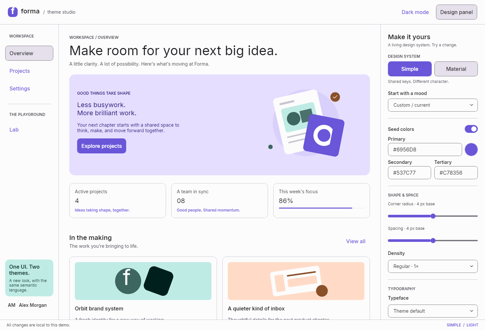

# ThemeStudio

A live Uno Platform demo of **Simple**, **Material**, and their shared semantic design language. Explore a fictional creative workspace called Forma while changing its entire design system in real time.



## Explore

- Switch **Simple ↔ Material** without losing form edits, new projects, or unfinished drafts.
- Change primary, secondary, and tertiary **seed colors** live, use the color picker, or try a preset.
- Adjust **corner radius, spacing, density, typeface, and typography scale** across the screens.
- Compare **light and dark** appearances and inspect paired semantic colors and resolved tokens in the **Lab**.
- Explore an illustrated dashboard, create and search projects, and edit workspace preferences.
- Hide the design panel for presentations or resize to a narrow viewport for compact navigation.

All data stays in memory for the current session. Project progress and activity are illustrative; there is no backend or account setup.

## Get started

Install the [.NET SDK](https://dotnet.microsoft.com/download) version specified in `global.json` (10.0.401, or a later 10.0.4xx patch). For the browser target, install its matching workload:

```shell
dotnet workload install wasm-tools
```

Then run commands from the repository root:

```shell
git clone https://github.com/kazo0/ThemeStudio.git
cd ThemeStudio
dotnet run --project ThemeStudio.csproj -f net10.0-desktop
```

For WebAssembly:

```shell
dotnet run --project ThemeStudio.csproj -f net10.0-browserwasm --launch-profile "Theme Studio (WebAssembly)"
```

Open <http://localhost:5127> if the browser does not open automatically. Windows users can also run `./run-desktop.ps1` or `./run-browser.ps1`. `ThemeStudio.slnx` is provided for IDEs that support the solution format.

## Packages

Everything restores from the public nuget.org feed; no private feed or credentials are required.

| Component | Pinned version | Source |
| --- | --- | --- |
| Uno SDK (`Uno.Sdk.Private`) | `7.0.0-dev.701` | nuget.org |
| Uno.Material.WinUI, Uno.Simple.WinUI | `9.0.0-dev.29` | nuget.org |

Material and Simple use Uno.Themes internals, so they are pinned together through `ThemesVersion` in
`ThemeStudio.csproj`. Uno.Themes 9.0.0-dev.29 builds against Uno 7.0.0-dev.701, so the app uses the same SDK. That SDK's
Debug-only App MCP client loads an assembly Uno 7 does not ship, so `UnoDisableMCPSupport` is set, as in the Uno.Themes
sample apps.

## A short presentation walkthrough

1. Start on **Overview**, then switch **Simple → Material → Simple**. Observe the same semantic keys producing different control templates and typography.
2. Try **Botanical**, **Terracotta**, and **Ocean at night**. Turn **Seed colors** on and edit a seed color, or turn it back off to restore the theme's default palette.
3. Move **Corner radius** and **Spacing**. Compare **Compact**, **Regular**, and **Comfy**. Density scales spacing by 0.75, 1, or 1.25; fixed control heights remain constant.
4. Switch between **Inter**, **Roboto**, and the theme's default typeface, then change **Type scale**.
5. Create a project or start a draft in **Projects**. Edit your workspace name in **Settings**. Switch themes again to demonstrate preserved state.
6. Open **Lab** to show semantic style names, paired palette roles, typography examples, and resolved token values. Toggle light/dark to compare both palettes.
7. Use **Reset design** to restore the starting appearance while retaining workspace edits.

## Implementation

`ThemeController` installs one `BaseTheme` (`SimpleTheme` or `MaterialTheme`) in application resources. Views use semantic styles such as `FilledButtonStyle`, semantic typography such as `BodyMedium`, and paired semantic brushes.

Seed changes through `ThemeColors` update existing brush instances. `DefaultCornerRadius`, `DefaultSpacing`, `DefaultDensity`, and `DefaultFontFamily` regenerate the real theme tokens. `FontOverrideDictionary` scales the active theme's original typography sizes. A root `RequestedTheme` refresh makes existing controls resolve updated immutable tokens; this demo technique follows the Uno.Themes samples.

Changing design systems rebuilds the view tree to resolve the new templates. Styles use `StaticResource` within that tree; brushes and tokens use `ThemeResource` for live updates. `StudioState` lives outside the tree and retains user edits. Text buttons explicitly bind their size to `LabelLargeFontSize` so font scaling reaches templates that otherwise snapshot that token. The semantic lab reads color values from realized brushes to follow the page's actual appearance.

## Validate

```shell
dotnet build ThemeStudio.csproj -f net10.0-desktop
dotnet build ThemeStudio.csproj -f net10.0-browserwasm
dotnet bin/Debug/net10.0-desktop/ThemeStudio.dll --smoke
```

The desktop smoke invokes real controls through automation peers and checks theme changes, brush updates, generated and rendered tokens, typography, retained drafts, project creation/search, dark mode, presets, reset, and narrow navigation. It saves results and screenshots under `bin/Debug/net10.0-desktop/SmokeResults` and exits with a nonzero code on failure. Run it in a desktop session.

An optional browser inspection harness, `verify-browser.mjs`, uses Node.js 22+ and a locally running Chromium debugging endpoint at `http://localhost:9227`. Start the browser app, open it in that Chromium instance, then run `node verify-browser.mjs`. It captures a screenshot and browser errors under the git-ignored `verification` directory.

## License

[Apache License 2.0](LICENSE). Built with [Uno Platform](https://platform.uno) and [Uno.Themes](https://github.com/unoplatform/uno.themes).
